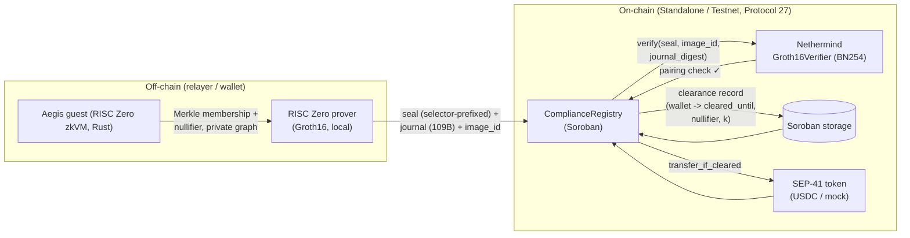

# Aegis — Provable Clean-Funds Compliance Coprocessor for Stellar

> A wallet proves — **in zero knowledge** — that all of its recent counterparties
> belong to a screened *allow-set* (Association Set Provider). A Soroban contract
> verifies the RISC Zero **Groth16** proof on-chain and gates the wallet's
> stablecoin transfers on that proof. Privacy is preserved; compliance is
> provable.

**Stellar Hacks: Real-World ZK** submission. Built with RISC Zero zkVM + Soroban
(Protocol 27 / BN254 host functions). **Deployed and verified on the public
Stellar testnet** — judges can inspect every transaction on stellar.expert (links
below).

---

## Why

Stablecoin issuers and regulators want **compliance** (no flow to sanctioned
addresses). Users want **privacy** (don't publish your transaction graph). These
goals conflict on a transparent ledger. Aegis resolves the conflict with ZK: the
wallet proves its funds are "clean" **without revealing its counterparty graph**,
and a Soroban gate enforces that proof before any transfer clears.

This maps directly onto SDF's north-star — *"compliance-ready from the start"* —
and the Confidential Tokens compliance layer (auditor view keys, selective
disclosure, policy engine). Aegis is the **proof layer** under such a policy
engine: a verifiable, non-replayable attestation that a wallet's activity is
clean *as of a ledger*.

## What ZK proves (load-bearing)

A RISC Zero guest takes, **privately**:
- the wallet's counterparty activity graph,
- a SHA-256-committed **allow-set** Merkle root (screened addresses; Poseidon2
  host-fn swap-in is planned),
- a wallet secret (for the nullifier),

and proves, **without revealing the graph**:

1. **Membership** — every one of the wallet's K counterparties is a leaf of the
   allow-set Merkle tree (cleared).
2. **Non-membership / deny-set** — (stretch) no counterparty is in a sanctions
   deny-set, and no path reaches a sanctioned address.
3. **Nullifier** — `SHA-256("aegis_null" || wallet_address || wallet_secret ||
   allow_set_root || as_of_block)`, domain-separated and **bound to the wallet
   and the ledger** (not just the secret): two wallets cannot share a nullifier,
   one wallet cannot rotate its secret to bypass anti-replay, and the same
   `(secret, root)` can legitimately re-prove as the ASP root advances.

The guest commits a 109-byte journal via `env::commit_slice`:

```
[ 0..32 ] wallet_address      (32B, ed25519 pubkey / contract id)
[32..64 ] allow_set_root      (32B, Merkle root the proof was checked against)
[64..96 ] nullifier           (32B, SHA256("aegis_null"||wallet||secret||root||as_of_block))
[96..100] K                   (u32 LE, counterparties screened)
[100..108] as_of_block        (u64 LE, ledger the proof is "as of")
[108    ] pass                (1B, 1 = all counterparties cleared)
```

A **Groth16 seal** (selector-prefixed) is produced. The on-chain
`ComplianceRegistry` hashes the journal, calls the Nethermind
`stellar-risc0-verifier` to verify the seal against `(image_id, journal_digest)`,
then enforces the public claims: `image_id` match, `allow_set_root` match,
`wallet` match (via `Address::to_payload`), `pass == 1`, and nullifier
non-replay. Only then is the wallet marked **cleared** for a TTL window.

> **The transfer gate rejects without a valid Groth16 seal.** ZK is load-bearing:
> remove the proof and the gate cannot be satisfied — there is no other path to
> "cleared".

## Why RISC Zero (differentiation)

Aegis is the **only RISC Zero zkVM *compliance* coprocessor** in the field —
other RISC Zero projects target proof-of-reserves, payment receipts, or
settlement, while the remaining compliance submissions use Noir or Circom
hand-written circuits. That choice is deliberate and load-bearing for the
compliance use-case:

- **zkVM over circuits.** Compliance logic is branching and graph-shaped
  (membership today, deny-set + graph reachability tomorrow). Writing it as a
  Rust program compiled by the zkVM is far cheaper to get right and to audit
  than an equivalent hand-rolled Noir/Circom circuit, and it composes with
  standard crates.
- **SDF-aligned infrastructure.** RISC Zero on Stellar is one of SDF's named ZK
  stacks, with an official Nethermind on-chain verifier (`stellar-risc0-verifier`)
  that Aegis forks — we build on promoted primitives, not a bespoke circuit.
- **Groth16 on-chain is the right trade for a gate.** A compliance gate verifies
  proofs *frequently* (every transfer). Groth16 seals are ~260 B and verify in a
  single BN254 `pairing_check` (~12M Soroban instr); STARKs would be ~100 KB and
  blow the 100M-instruction WASM budget. vs Noir/UltraHonk (~35M instr on
  Soroban), Groth16 is the cheaper on-chain verify for this access pattern.
- **Compliance coprocessor, not a privacy mixer.** The proof is a reusable
  attestation that *gates* any SEP-41 transfer — the same clearance unlocks
  USDC, EURC, any token — rather than a one-shot shielded pool. This is the
  "proof layer under SDF's Confidential Tokens policy engine" framing.
- **Cycle optimization is reported** (single segment, ~105k user cycles, the
  accelerator headroom noted above) — the same win pattern that took the prior
  RISC Zero hackathon winner (Chickenz.io) to 1st place.

## Architecture



Flow: **prove → on-chain verify → clearance → gated transfer**.

- Clean wallet: proof verifies → clearance stored → `transfer_if_cleared` succeeds.
- Tainted / no-proof wallet: proof absent or `pass=0` → no clearance →
  `transfer_if_cleared` reverts `NotCleared` (#9).

## Contracts — deployed on public Stellar **testnet** (Protocol 27)

| Contract | Role | Testnet contract ID |
|---|---|---|
| `Groth16Verifier` (Nethermind) | Stateless BN254 Groth16 pairing check; params embedded at build time | `CBZAX43T4YNSWNWM2GCIHUSNWUAQYMOD5RJZVLNNC3UDIG6Z6IOQUZNB` |
| `ComplianceRegistry` (Aegis) | Verifies seal, parses journal, enforces claims, stores clearance, gates transfer | `CAI3XYL2KRM7BCJYN46DODKGIIKMFFNFWYPNKRRWYXVE3ZIXBTGQCERB` |
| `MockToken` (demo SEP-41) | Token the gate transfers on success | `CDQDBN2HA64U4M3MCIDHHRQCL5XOXE5CVSZNFGBAKQ6LD5GFVNE67AMK` |

**stellar.expert (judge-verifiable):**
- Verifier — https://stellar.expert/explorer/testnet/contract/CBZAX43T4YNSWNWM2GCIHUSNWUAQYMOD5RJZVLNNC3UDIG6Z6IOQUZNB
- Registry — https://stellar.expert/explorer/testnet/contract/CAI3XYL2KRM7BCJYN46DODKGIIKMFFNFWYPNKRRWYXVE3ZIXBTGQCERB
- Token — https://stellar.expert/explorer/testnet/contract/CDQDBN2HA64U4M3MCIDHHRQCL5XOXE5CVSZNFGBAKQ6LD5GFVNE67AMK

Live transactions (testnet): `init` `986b3da8…`, `register_compliance` (on-chain
Groth16 verify) `25f9e655…`, `transfer_if_cleared` `1a942cf1…` — searchable at
`https://stellar.expert/explorer/testnet/tx/<hash>`.

Key guest constants (reproducible from source):
- Image ID: `eddc2223c80408e93512ec945c1832e450e78c334fb482c318c17c929d2d4b6f`
- Selector: `73c457ba`
- Demo allow-set root (depth-2, 4 leaves): `48c73f7821a58a8d2a703e5b39c571c0aa20cf14abcd0af8f2b955bc202998de`

> A local standalone P27 deploy (`scripts/m2_*.sh`) is used for fast iteration;
> its contract IDs rotate on each reset. The testnet IDs above are stable for the
> judging window (persistent entries are bumped to ~100k ledgers on `init`/`register`).

## Demo results (end-to-end, on Protocol 27 — testnet + local standalone)

**Clean path** — wallet `alice`, counterparties both in allow-set:
1. `register_compliance(alice, journal, seal, image_id)` → on-chain Groth16
   verify **passes**, clearance stored.
2. `is_cleared(alice)` → `true`; `get_clearance(alice)` →
   `{k: 2, as_of_block: 12345, cleared_until_ledger: <seq+ttl>, nullifier: 0x6831a291…}`
   (nullifier is bound to alice's pubkey + secret + root + as_of_block).
3. `transfer_if_cleared(alice → bob, 1000)` → **succeeds**.
4. Balances: alice `999_999_000`, bob `1_000`.

**Blocked path** — wallet `bob` (no proof):
1. `is_cleared(bob)` → `false`.
2. `transfer_if_cleared(bob → alice, 1)` → **reverts `Error(Contract, #9)` =
   `NotCleared`**. The gate holds.

**Negative tests (soundness of the on-chain verifier binding):**
- **Tampered seal** (flip one byte) → `register_compliance` reverts
  `Error(Contract, #10)` = `ProofVerificationFailed`. The Nethermind verifier
  traps inside `bn254_multi_pairing_check` ("G1: point not on curve") and the
  registry converts the failed `try_invoke` into `#10`. A forged seal cannot
  produce a clearance.
- **Wrong image_id** → reverts `Error(Contract, #11)` = `BadImageId` (caught
  before the verifier call; a seal from a different guest program is rejected).
- **K = 0** → the guest `assert!(k > 0)` makes such a proof un-generatable, and
  the registry additionally reverts `Error(Contract, #13)` = `ZeroK` if a
  malformed journal ever reaches parsing. The "all counterparties compliant"
  claim cannot be vacuously true.

> The `verify` entrypoint of the Nethermind verifier returns `Result<(),
> VerifierError>` (reverts on failure) rather than a bool, so `Ok(Ok(_))` from
> `try_invoke_contract` is a genuine pass — confirmed by the tampered-seal test
> above.

## Performance — guest cycle counts

RISC Zero reports (1 segment, after the wallet/ledger-bound nullifier + `assert!(k>0)`):

| metric | cycles |
|---|---|
| total cycles | 262,144 |
| **user cycles** | **105,224** |
| paging cycles | 25,361 |
| reserved cycles | 131,559 |

The compliance check (SHA-256 Merkle verification of K=2 counterparties over a
depth-2 tree + domain-separated nullifier + journal commit) fits in a single
segment with ~105k user cycles — well under the Soroban 100M-instruction WASM
budget, and the on-chain verify is a single BN254 `pairing_check` (~12M instr).
The guest is `no_std`, uses `env::commit_slice` for a raw 109-byte journal (no
ABI overhead), and SHA-256 for the demo tree (Poseidon2 host fn swap-in is a
one-line change for Protocol 25+).

> **Optimization headroom (not in the demo):** the guest currently uses the
> stock `sha2` crate (software SHA-256). Switching to the RISC Zero hardware
> SHA-256 accelerator (`risc0_zkvm::sha::Impl`) is expected to cut user cycles
> ~5-10× — a meaningful cycle-optimization win we'd report in a production
> writeup (cycle optimization is a known RISC Zero win pattern).

## Tech stack

- **RISC Zero zkVM** 3.0.x — Rust guest, Groth16 receipts, local proving (x86_64
  Linux via the `risc0-groth16` prover; Bonsai/Boundless not used).
- **Soroban** (Stellar Protocol 27) — `ComplianceRegistry` + `MockToken`,
  `soroban-sdk` 25.1. Admin-gated `init` (with `require_auth`), persistent-entry
  TTL bumped on `init`/`register` so a public deploy stays live for the judging
  window (Soroban evicts persistent entries by TTL otherwise).
- **Nethermind `stellar-risc0-verifier`** — on-chain BN254 Groth16 verifier
  (selector + image_id + journal_digest).
- **Stellar CLI** v27 — deploy, invoke, keys.

## Repository structure

```
aegis/
├── risc0/                      # zkVM project (cargo workspace)
│   ├── host/                   # off-chain prover: builds demo tree, runs guest, emits seal+journal
│   └── methods/
│       ├── guest/              # Aegis compliance guest (no_std, Merkle membership + nullifier)
│       └── src/                # methods lib (ELF + image id)
├── contracts/
│   ├── compliance-registry/    # Aegis ComplianceRegistry (Soroban)
│   └── mock-token/             # demo SEP-41 token
├── scripts/                    # m2_* local P27, m4_demo E2E, m5_testnet public deploy
├── artifacts/                  # built wasms (groth16_verifier, compliance_registry, mock_token)
├── demo-video/                 # Playwright terminal-replay generator -> aegis-demo.mp4
├── demo-script.md              # 2-3 min video walkthrough script
├── SUBMISSION.md               # paste-ready DoraHacks BUIDL + Discord #zk-chat text
└── README.md
```

## Build & run

> Built/proved on WSL2 Ubuntu (x86_64) with `rustup` + `rzup` (riscv guest
> toolchain) + `risc0-groth16` prover (Docker). Contracts deploy to a Stellar
> quickstart standalone network at **Protocol 27** (the Nethermind verifier
> needs BN254 scalar-field host functions, P26+).

```bash
# 1. Local Soroban network at Protocol 27
docker run -d --name stellar-local --restart unless-stopped -p 8000:8000 \
  stellar/quickstart --local --limits unlimited --protocol-version 27

# 2. Generate + fund keys
stellar keys generate alice --network local   # repeat for bob, carol
curl "http://localhost:8000/friendbot?addr=$(stellar keys address alice)"

# 3. Prove (off-chain) — pass the funded wallet's 32-byte pubkey (decoded from G… strkey)
cargo run --release -p aegis_host -- <wallet_pubkey_hex> <wallet_secret_hex>
#   -> prints Seal, Image ID, Journal, Journal SHA-256; writes proof.txt

# 4. Deploy contracts
stellar contract deploy --wasm artifacts/groth16_verifier.wasm \
  --source-account alice --network local --alias aegis_verifier
stellar contract deploy --wasm artifacts/compliance_registry.wasm \
  --source-account alice --network local --alias aegis_registry

# 5. Init registry
stellar contract invoke --id aegis_registry --source-account alice --network local --send yes -- \
  init --admin <alice_G> --verifier_id <verifier_C> \
       --image_id <image_id_hex> --allow_set_root <root_hex> --ttl_ledgers 1000

# 6. Register compliance (on-chain Groth16 verify)
stellar contract invoke --id aegis_registry --source-account alice --network local --send yes -- \
  register_compliance --wallet <alice_G> --journal <journal_hex> \
       --seal <seal_hex> --image_id <image_id_hex>

# 7. Gate a transfer
stellar contract invoke --id aegis_registry --source-account alice --network local --send yes -- \
  transfer_if_cleared --from <alice_G> --to <bob_G> --amount 1000 --token <token_C>
```

The `scripts/m2_*.sh` and `scripts/m4_demo.sh` automate the full local sequence
on WSL. `scripts/m5_testnet.sh` re-proves with a testnet-funded key and deploys
all three contracts to the **public Stellar testnet** (Protocol 27), printing
stellar.expert URLs — that is what produced the testnet IDs above.

## Limitations & future work

- **Counterparty-set completeness is not enforced by ZK.** The guest proves
  "every one of the K counterparties I disclosed is in the allow-set"; it does
  *not* prove "I disclosed all of my counterparties". Binding the disclosed set
  to a wallet's real on-chain activity graph (e.g. via a signed commitment the
  ASP countersigns) is the main production extension. The nullifier, wallet
  binding, image_id and root binding are all enforced; this is specifically about
  *which* counterparties the prover chooses to disclose.
- **Gate is opt-in.** `transfer_if_cleared` is a compliant path; a malicious
  wallet could call `token.transfer` directly. Production enforcement needs the
  token/issuer itself to check `is_cleared` (SAC controlled-token pattern) or
  the registry to sit as a transfer proxy. The demo proves the *gate logic*,
  not ubiquitous enforcement.
- **Demo tree is fixed** (depth-2, 4 leaves, SHA-256). Production swaps SHA-256
  for **Poseidon2** (Stellar host fn) and ingests a real ASP allow-set root.
- **Membership only** in the MVP; the **non-membership / deny-set + graph
  reachability** path is architected but not in the demo guest (stretch goal).
- **No batch aggregation** yet: N wallets = N verifies. Planned: aggregate N
  seals via one `bn254_multi_pairing_check` ("pushing primitives").
- **Local proving** for the demo; a relayer proving service is the production
  shape (wallet never proves). Mock SEP-41 token in the demo (real USDC/SAC
  integration is the production shape).
- **Demo video** is a terminal-replay rendered from a real run's artifacts
  (real seal, image_id, journal, balances) via Playwright — not a live screen
  capture. All values are reproducible from `scripts/`.
- Hackathon prototype — **not audited**; the on-chain Groth16 verifier is itself
  a Stellar dev preview.

## References

- Nethermind `stellar-risc0-verifier` — on-chain RISC Zero Groth16 verifier.
- RISC Zero zkVM — https://www.risczero.com/
- Stellar Protocol 25 "X-Ray" / 26 "Yardstick" — BN254 host functions.
- SDF Confidential Tokens — compliance-focused privacy on Stellar.

## License

MIT (see `LICENSE`). Aegis code is original; the Nethermind verifier is included
as a built artifact under its own license.
