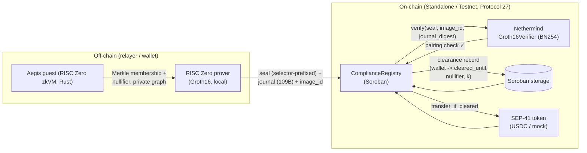

# Aegis — Provable Clean-Funds Compliance Coprocessor for Stellar

> A wallet proves — **in zero knowledge** — that all of its recent counterparties
> belong to a screened *allow-set* (Association Set Provider). A Soroban contract
> verifies the RISC Zero **Groth16** proof on-chain and gates the wallet's
> stablecoin transfers on that proof. Privacy is preserved; compliance is
> provable.

**Stellar Hacks: Real-World ZK** submission. Built with RISC Zero zkVM + Soroban
(Protocol 27 / BN254 host functions).

---

## Why

Stablecoin issuers and regulators want **compliance** (no flow to sanctioned
addresses). Users want **privacy** (don't publish your transaction graph). These
goals conflict on a transparent ledger. Aegis resolves the conflict with ZK: the
wallet proves its funds are "clean" **without revealing its counterparty graph**,
and a Soroban gate enforces that proof before any transfer clears.

This maps directly onto SDF's north-star — *"compliance-ready from the start"* —
and the Confidential Tokens compliance layer (auditor view keys, selective
disclosure, policy engine). Aegis is the **proof layer** under such a policy
engine: a verifiable, non-replayable attestation that a wallet's activity is
clean *as of a ledger*.

## What ZK proves (load-bearing)

A RISC Zero guest takes, **privately**:
- the wallet's counterparty activity graph,
- a Poseidon/SHA-256-committed **allow-set** Merkle root (screened addresses),
- a wallet secret (for the nullifier),

and proves, **without revealing the graph**:

1. **Membership** — every one of the wallet's K counterparties is a leaf of the
   allow-set Merkle tree (cleared).
2. **Non-membership / deny-set** — (stretch) no counterparty is in a sanctions
   deny-set, and no path reaches a sanctioned address.
3. **Nullifier** — `SHA-256(wallet_secret || root)`, binding the proof to one
   wallet/root pair and preventing on-chain replay.

The guest commits a 109-byte journal via `env::commit_slice`:

```
[ 0..32 ] wallet_address      (32B, ed25519 pubkey / contract id)
[32..64 ] allow_set_root      (32B, Merkle root the proof was checked against)
[64..96 ] nullifier           (32B, anti-replay)
[96..100] K                   (u32 LE, counterparties screened)
[100..108] as_of_block        (u64 LE, ledger the proof is "as of")
[108    ] pass                (1B, 1 = all counterparties cleared)
```

A **Groth16 seal** (selector-prefixed) is produced. The on-chain
`ComplianceRegistry` hashes the journal, calls the Nethermind
`stellar-risc0-verifier` to verify the seal against `(image_id, journal_digest)`,
then enforces the public claims: `image_id` match, `allow_set_root` match,
`wallet` match (via `Address::to_payload`), `pass == 1`, and nullifier
non-replay. Only then is the wallet marked **cleared** for a TTL window.

> **The transfer gate rejects without a valid Groth16 seal.** ZK is load-bearing:
> remove the proof and the gate cannot be satisfied — there is no other path to
> "cleared".

## Architecture



Flow: **prove → on-chain verify → clearance → gated transfer**.

- Clean wallet: proof verifies → clearance stored → `transfer_if_cleared` succeeds.
- Tainted / no-proof wallet: proof absent or `pass=0` → no clearance →
  `transfer_if_cleared` reverts `NotCleared` (#9).

## Contracts

| Contract | Role | Local P27 ID |
|---|---|---|
| `Groth16Verifier` (Nethermind) | Stateless BN254 Groth16 pairing check; params embedded at build time | `CCO4CWG7BTU4HABSL5VX72D54V6PKXJVVDZXK4L6Y6WLDQZNEPQUUDUK` |
| `ComplianceRegistry` (Aegis) | Verifies seal, parses journal, enforces claims, stores clearance, gates transfer | `CBRJNIYRBY7CKDSIPVA7FWUBTTTEVMHBYXR26XN7W3PGUOYPDW55GGQG` |
| `MockToken` (demo SEP-41) | Token the gate transfers on success | `CCQSMTUDKNKT42VA5V3FDGPTPINQL4FXO7GPPMXENNLCCJEGLDPFIVHB` |

Key guest constants (reproducible):
- Image ID: `e7b796e2dd9cb249e5853ba2903f1e94a2aefdc425c36913b3b8911b677018d2`
- Selector: `73c457ba`
- Demo allow-set root (depth-2, 4 leaves): `48c73f7821a58a8d2a703e5b39c571c0aa20cf14abcd0af8f2b955bc202998de`

## Demo results (end-to-end, on a Protocol 27 Soroban network)

**Clean path** — wallet `alice`, counterparties both in allow-set:
1. `register_compliance(alice, journal, seal, image_id)` → on-chain Groth16
   verify **passes**, clearance stored.
2. `is_cleared(alice)` → `true`; `get_clearance(alice)` →
   `{k: 2, as_of_block: 12345, cleared_until_ledger: 1130, nullifier: 0xeaa7d967…}`.
3. `transfer_if_cleared(alice → bob, 1000)` → **succeeds**.
4. Balances: alice `999_999_000`, bob `1_000`.

**Blocked path** — wallet `bob` (no proof):
1. `is_cleared(bob)` → `false`.
2. `transfer_if_cleared(bob → alice, 1)` → **reverts `Error(Contract, #9)` =
   `NotCleared`**. The gate holds.

## Performance — guest cycle counts

RISC Zero reports (1 segment):

| metric | cycles |
|---|---|
| total cycles | 262,144 |
| **user cycles** | **104,956** |
| paging cycles | 24,691 |
| reserved cycles | 132,497 |

The compliance check (SHA-256 Merkle verification of K=2 counterparties over a
depth-2 tree + nullifier + journal commit) fits in a single segment with ~105k
user cycles — well under the Soroban 100M-instruction WASM budget, and the
on-chain verify is a single BN254 `pairing_check` (~12M instr). The guest is
`no_std`, uses `env::commit_slice` for a raw 109-byte journal (no ABI overhead),
and SHA-256 for the demo tree (Poseidon2 host fn swap-in is a one-line change for
Protocol 25+).

## Tech stack

- **RISC Zero zkVM** 3.0.x — Rust guest, Groth16 receipts, local proving (x86_64
  Linux via the `risc0-groth16` prover; Bonsai/Boundless not used).
- **Soroban** (Stellar Protocol 27) — `ComplianceRegistry` + `MockToken`,
  `soroban-sdk` 25.1.
- **Nethermind `stellar-risc0-verifier`** — on-chain BN254 Groth16 verifier
  (selector + image_id + journal_digest).
- **Stellar CLI** v27 — deploy, invoke, keys.

## Repository structure

```
aegis/
├── risc0/                      # zkVM project (cargo workspace)
│   ├── host/                   # off-chain prover: builds demo tree, runs guest, emits seal+journal
│   └── methods/
│       ├── guest/              # Aegis compliance guest (no_std, Merkle membership + nullifier)
│       └── src/                # methods lib (ELF + image id)
├── contracts/
│   ├── compliance-registry/    # Aegis ComplianceRegistry (Soroban)
│   └── mock-token/             # demo SEP-41 token
├── scripts/                    # M2/M4 run scripts (WSL)
├── artifacts/                  # built wasms
└── README.md
```

## Build & run

> Built/proved on WSL2 Ubuntu (x86_64) with `rustup` + `rzup` (riscv guest
> toolchain) + `risc0-groth16` prover (Docker). Contracts deploy to a Stellar
> quickstart standalone network at **Protocol 27** (the Nethermind verifier
> needs BN254 scalar-field host functions, P26+).

```bash
# 1. Local Soroban network at Protocol 27
docker run -d --name stellar-local --restart unless-stopped -p 8000:8000 \
  stellar/quickstart --local --limits unlimited --protocol-version 27

# 2. Generate + fund keys
stellar keys generate alice --network local   # repeat for bob, carol
curl "http://localhost:8000/friendbot?addr=$(stellar keys address alice)"

# 3. Prove (off-chain) — pass the funded wallet's 32-byte pubkey (decoded from G… strkey)
cargo run --release -p aegis_host -- <wallet_pubkey_hex> <wallet_secret_hex>
#   -> prints Seal, Image ID, Journal, Journal SHA-256; writes proof.txt

# 4. Deploy contracts
stellar contract deploy --wasm artifacts/groth16_verifier.wasm \
  --source-account alice --network local --alias aegis_verifier
stellar contract deploy --wasm artifacts/compliance_registry.wasm \
  --source-account alice --network local --alias aegis_registry

# 5. Init registry
stellar contract invoke --id aegis_registry --source-account alice --network local --send yes -- \
  init --admin <alice_G> --verifier_id <verifier_C> \
       --image_id <image_id_hex> --allow_set_root <root_hex> --ttl_ledgers 1000

# 6. Register compliance (on-chain Groth16 verify)
stellar contract invoke --id aegis_registry --source-account alice --network local --send yes -- \
  register_compliance --wallet <alice_G> --journal <journal_hex> \
       --seal <seal_hex> --image_id <image_id_hex>

# 7. Gate a transfer
stellar contract invoke --id aegis_registry --source-account alice --network local --send yes -- \
  transfer_if_cleared --from <alice_G> --to <bob_G> --amount 1000 --token <token_C>
```

The `scripts/m2_*.sh` and `scripts/m4_demo.sh` automate the full sequence on
WSL.

## Limitations & future work

- **Demo tree is fixed** (depth-2, 4 leaves, SHA-256). Production swaps SHA-256
  for **Poseidon2** (Stellar host fn) and ingests a real ASP allow-set root.
- **Membership only** in the MVP; the **non-membership / deny-set + graph
  reachability** path is architected but not in the demo guest (stretch goal).
- **No batch aggregation** yet: N wallets = N verifies. Planned: aggregate N
  seals via one `bn254_multi_pairing_check` ("pushing primitives").
- **Local proving** for the demo; a relayer proving service is the production
  shape (wallet never proves).
- Hackathon prototype — **not audited**; the on-chain Groth16 verifier is itself
  a Stellar dev preview.

## References

- Nethermind `stellar-risc0-verifier` — on-chain RISC Zero Groth16 verifier.
- RISC Zero zkVM — https://www.risczero.com/
- Stellar Protocol 25 "X-Ray" / 26 "Yardstick" — BN254 host functions.
- SDF Confidential Tokens — compliance-focused privacy on Stellar.

## License

MIT (see `LICENSE`). Aegis code is original; the Nethermind verifier is included
as a built artifact under its own license.
